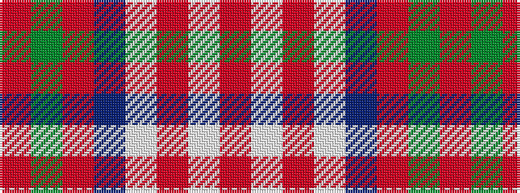

RGRBWRWR

It is a 8 stripe tartan.

<figure class="pat-woven">

<figcaption>idealised sample</figcaption>
</figure>

## Colour Sequence



## Tartans with this colour sequence

| Tartans |
|---------------|
| [Gigha, Lilac (Dance)](/setts/s8/r4w2r1w18dp18m18g3m4~x2/)|
||
