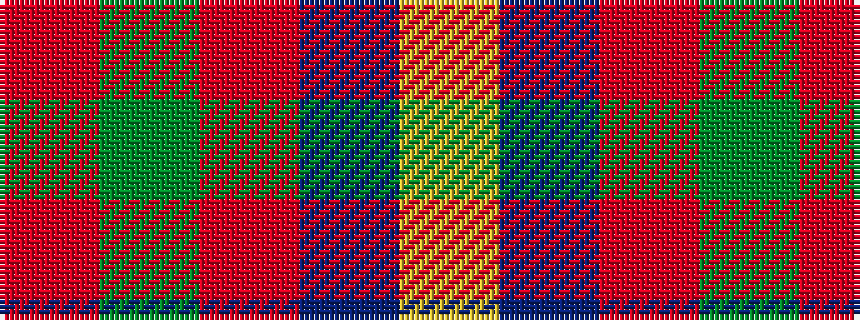

RGRBY

It is a 5 stripe tartan.

<figure class="pat-woven">

<figcaption>idealised sample</figcaption>
</figure>

## Colour Sequence



## Tartans with this colour sequence

| Tartans |
|---------------|
| [British Hills](/setts/s5/ly2db8r8g17r1~x4/)|
||
| [British Hills](/setts/s5/r2dg17r8db8ly2~x4/)|
||
| [Orion Nebula](/setts/s5/m49g3r5b15ly4~x2/)|
||
