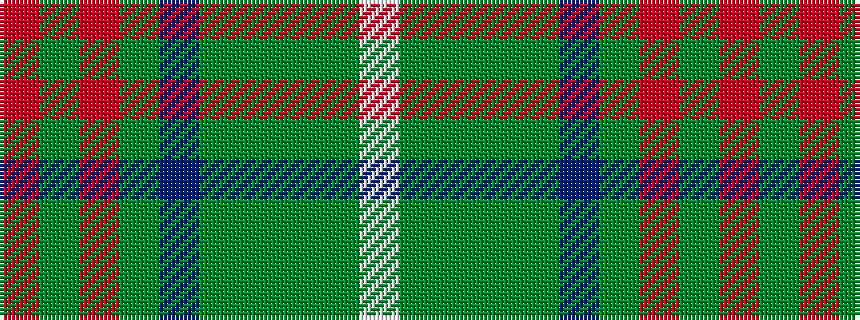

RGRGBGGGGW

It is a 10 stripe tartan.

<figure class="pat-woven">

<figcaption>idealised sample</figcaption>
</figure>

## Colour Sequence



## Tartans with this colour sequence

| Tartans |
|---------------|
| [Grewar (Name)](/setts/s10/o2g2o16g2dp17dg10g10g15dg1w2~x2/)|
||
