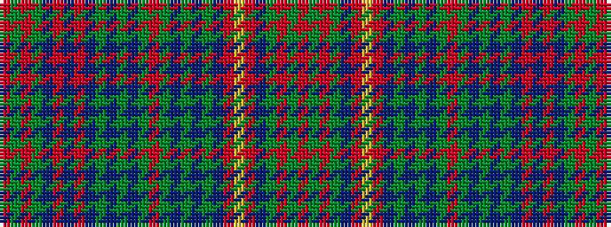

RGRGBRBRBGBGBGRGBGBGBRYRBGRGR

It is a 29 stripe tartan.

<figure class="pat-woven">

<figcaption>idealised sample</figcaption>
</figure>

## Colour Sequence



## Tartans with this colour sequence

| Tartans |
|---------------|
| [Shearer](/setts/s29/r2g4o2g11dt9ri12dt2ri12dt9g2dt2g2dt2g6r2g6dt2g2dt2g2dt9ri12lo2ri12dt9g11o2g4r2~x2/)|
||
