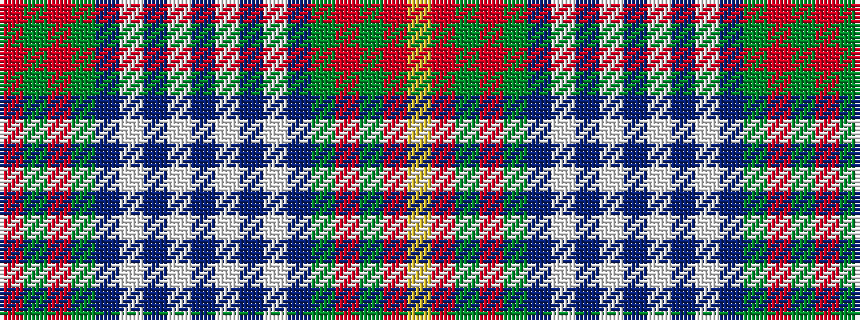

RGRGBWBWBWBWBGRGRY

It is a 18 stripe tartan.

<figure class="pat-woven">

<figcaption>idealised sample</figcaption>
</figure>

## Colour Sequence



## Tartans with this colour sequence

| Tartans |
|---------------|
| [Chinese Scottish](/setts/s18/r24g6r3g3db6w1db1w2db58w2db1w1db6g3r3g6r24ly3~x2/)|
||
