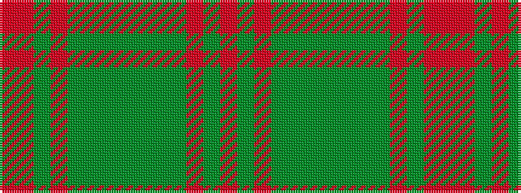

RGRGGGGGGGRGRR

It is a 14 stripe tartan.

<figure class="pat-woven">

<figcaption>idealised sample</figcaption>
</figure>

## Colour Sequence



## Tartans with this colour sequence

| Tartans |
|---------------|
| [Unidentified Lindley #6](/variants/s14/r4o3dy2o38y30dy3y3dy3~x2/)|
||
