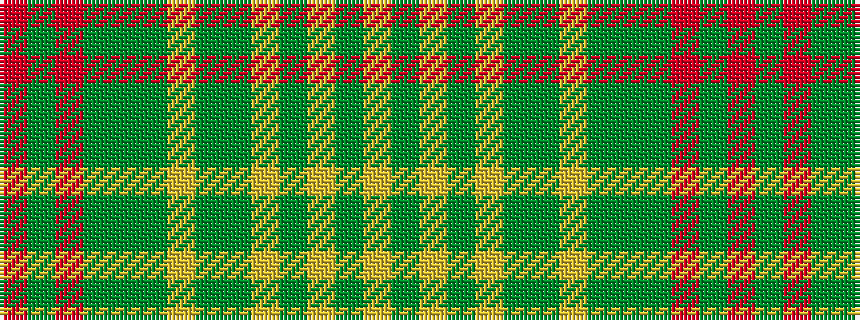

RGRGGGYGGYGYGY

It is a 14 stripe tartan.

<figure class="pat-woven">

<figcaption>idealised sample</figcaption>
</figure>

## Colour Sequence



## Tartans with this colour sequence

| Tartans |
|---------------|
| [Forster (Personal)](/setts/s14/r1dg20r1dg1dy2dg1ly1dg1dy4lr1dy1lr1dy1lr1~x4/)|
||
