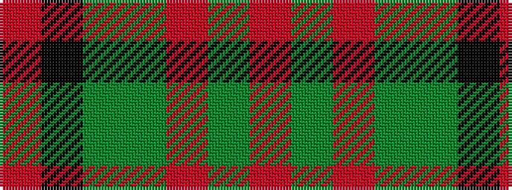

RGRGGKR

It is a 7 stripe tartan.

<figure class="pat-woven">

<figcaption>idealised sample</figcaption>
</figure>

## Colour Sequence



## Tartans with this colour sequence

| Tartans |
|---------------|
| [Tipperary, County](/setts/s7/r33k8dy12g12r8dy2r8~x2/)|
||
