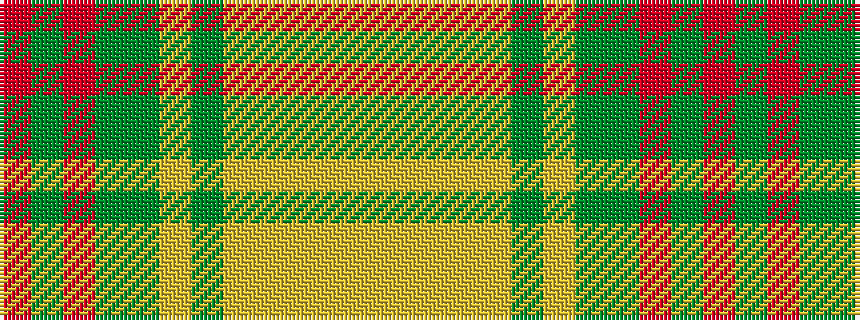

RGRGGYGYYYYY

It is a 12 stripe tartan.

<figure class="pat-woven">

<figcaption>idealised sample</figcaption>
</figure>

## Colour Sequence



## Tartans with this colour sequence

| Tartans |
|---------------|
| [Shrek](/setts/s12/o4g3o30y12g5lg4g3lg14lg2lg2lg10ly3~x2/)|
||
