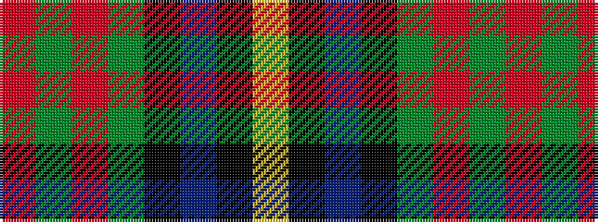

RGRGKBKY

It is a 8 stripe tartan.

<figure class="pat-woven">

<figcaption>idealised sample</figcaption>
</figure>

## Colour Sequence



## Tartans with this colour sequence

| Tartans |
|---------------|
| [Chan (Name?)](/variants/s8/r2dg13r2dg13k13dt30k1ly2~x2/)|
||
