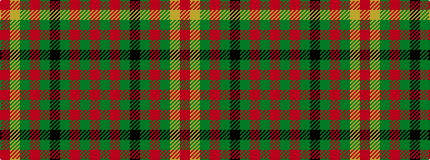

RGRGKGRGYR

It is a 10 stripe tartan.

<figure class="pat-woven">

<figcaption>idealised sample</figcaption>
</figure>

## Colour Sequence



## Tartans with this colour sequence

| Tartans |
|---------------|
| [Unnamed C20th - National Archives`](/setts/s10/r4dyi4r4dyi12k31dy16o1dy6ly1o1~x2/)|
||
