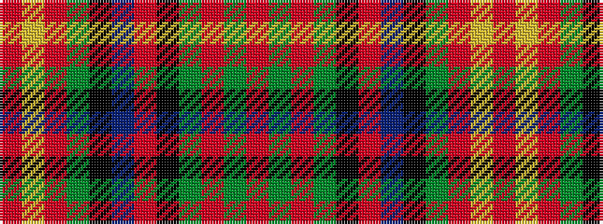

RGRGKRBKGRYR

It is a 12 stripe tartan.

<figure class="pat-woven">

<figcaption>idealised sample</figcaption>
</figure>

## Colour Sequence



## Tartans with this colour sequence

| Tartans |
|---------------|
| [Methodist Church](/setts/s12/r6dg2r2dg3k2r2db16k3dg4r34lo2r2~x2/)|
||
