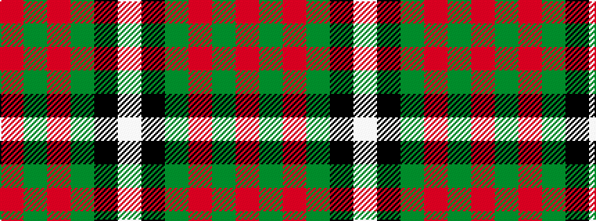

RGRGKW

It is a 6 stripe tartan.

<figure class="pat-woven">

<figcaption>idealised sample</figcaption>
</figure>

## Colour Sequence



## Tartans with this colour sequence

| Tartans |
|---------------|
| [MacGregor](/variants/s6/r36dg18r4dg6k1lb2/)|
||
| [MacGregor](/variants/s6/r36g18r4g6k1w2~x2/)|
||
| [MacGregor #3](/variants/s6/r36dg18r4dg6k1w2~x2/)|
||
| [MacGregor #4](/variants/s6/r41g19r7g8k1w3~x2/)|
||
| [MacGregor - 1800 (Clan)](/variants/s6/r57g21r8g8k1w3~x2/)|
||
| [MacGregor Hunting Glengyle Clan Tartan](/variants/s6/m96g42m16g17k4lb6/)|
||
| [MacGregor of Cardney](/variants/s6/m18g9m2g3k1w1~x4/)|
||
