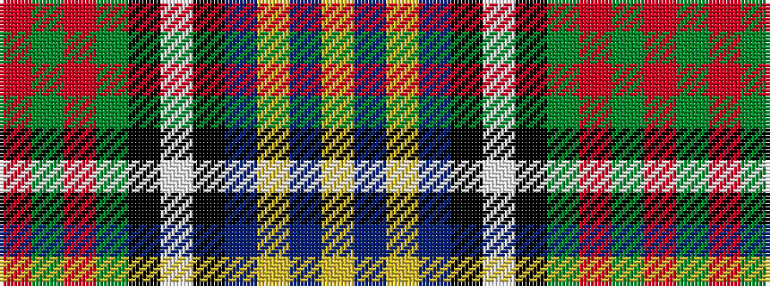

RGRGKWKBYBY

It is a 11 stripe tartan.

<figure class="pat-woven">

<figcaption>idealised sample</figcaption>
</figure>

## Colour Sequence



## Tartans with this colour sequence

| Tartans |
|---------------|
| [Glasgow, City of Culture](/setts/s11/r6g2r2g21k2w4k2db23ly2db2ly6~x2/)|
||
