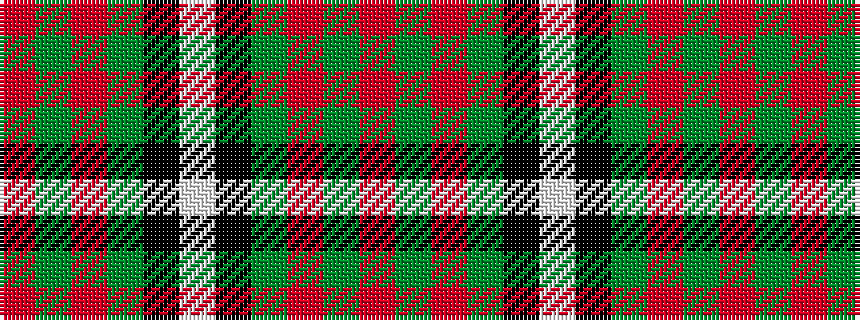

RGRGKWKGRGR

It is a 11 stripe tartan.

<figure class="pat-woven">

<figcaption>idealised sample</figcaption>
</figure>

## Colour Sequence



## Tartans with this colour sequence

| Tartans |
|---------------|
| [MacGregor](/setts/s11/r96g24r10g12k1w4k1g12r10g24r48~x2/)|
||
