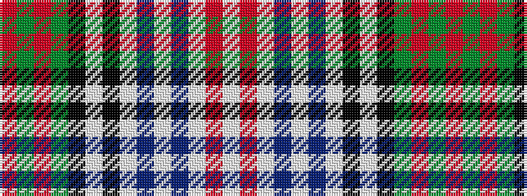

RGRGKWKWBWBWRW

It is a 14 stripe tartan.

<figure class="pat-woven">

<figcaption>idealised sample</figcaption>
</figure>

## Colour Sequence



## Tartans with this colour sequence

| Tartans |
|---------------|
| [Redgate in Connecticut (Ulster-Scots)](/setts/s14/r6dg4r2dg9k10w1k10lb3do2lb3do2lb11r3lb6~x2/)|
||
