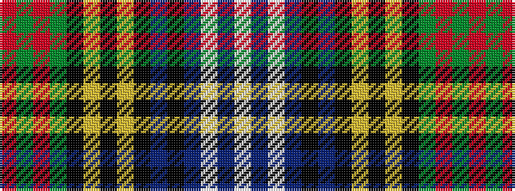

RGRGKYKYKBKBWBW

It is a 15 stripe tartan.

<figure class="pat-woven">

<figcaption>idealised sample</figcaption>
</figure>

## Colour Sequence



## Tartans with this colour sequence

| Tartans |
|---------------|
| [Estes](/variants/s15/r4g1r1g5k1lo1k1lo1k6t1k1t15w1t1w1~x4/)|
||
| [Estes](/variants/s15/r6g2r2g8k2ly2k2ly2k10db2k2db23w2db2w2~x2/)|
||
