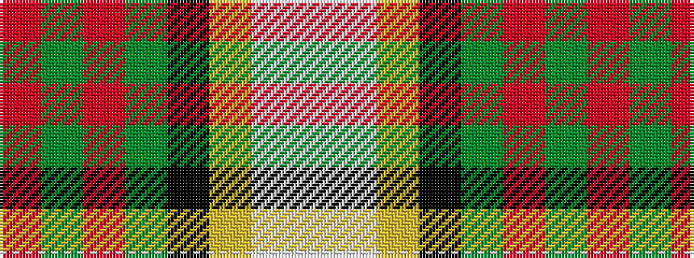

RGRGKYWW

It is a 8 stripe tartan.

<figure class="pat-woven">

<figcaption>idealised sample</figcaption>
</figure>

## Colour Sequence



## Tartans with this colour sequence

| Tartans |
|---------------|
| [Alexander of Menstry Hunting](/setts/s8/m5g2m2g26k9lr9lb13w5~x2/)|
||
