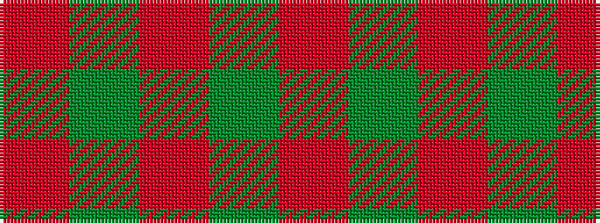

RGRGR

It is a 5 stripe tartan.

<figure class="pat-woven">

<figcaption>idealised sample</figcaption>
</figure>

## Colour Sequence



## Tartans with this colour sequence

| Tartans |
|---------------|
| [KaDeWe (Corporate)](/setts/s5/r100dg4r8dg18r3~x2/)|
||
| [MacNab #4](/setts/s5/ri86dg3r3dg6r85~x2/)|
||
| [MacNab 2](/setts/s5/r86g3ri3g6ri85~x2/)|
||
| [Pearson](/setts/s5/o3g14oi1g14o3~x4/)|
||
| [Unnamed Brown (Teddy Bear)](/setts/s5/r1dy7o25dy7r1~x2/)|
||
