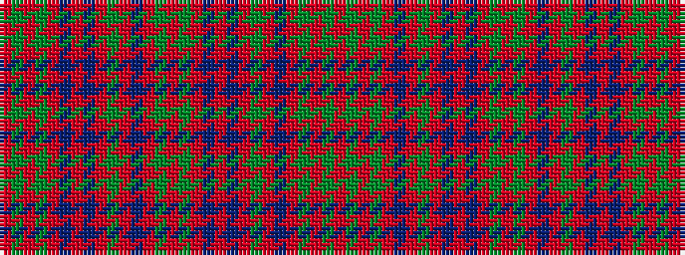

RGRGRBRBRGRBRGRGRBRBRGRBRGRGR

It is a 29 stripe tartan.

<figure class="pat-woven">

<figcaption>idealised sample</figcaption>
</figure>

## Colour Sequence



## Tartans with this colour sequence

| Tartans |
|---------------|
| [Robertson #4](/variants/s29/r28dg2r5dg2r28db3r3dg24r3db24r3db3r28dg2r5dg2r28db3r3dg24r3db24r3db3r28dg2r5dg2r28~x2/)|
||
| [Robertson 5](/variants/s29/r28g2r5g2r28db3r3db24r3g24r3db3r28g2r5g2r28db3r3db24r3g24r3db3r28g2r5g2r28~x2/)|
||
