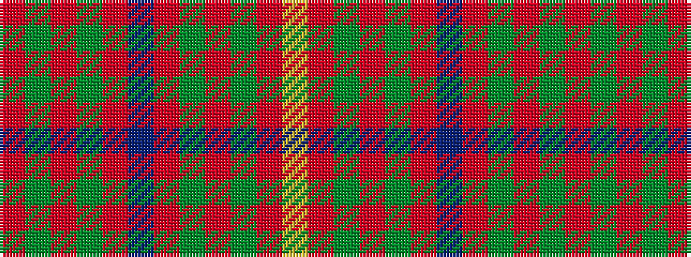

RGRGRBRGRGRY

It is a 12 stripe tartan.

<figure class="pat-woven">

<figcaption>idealised sample</figcaption>
</figure>

## Colour Sequence



## Tartans with this colour sequence

| Tartans |
|---------------|
| [Capricornica (Fashion)](/variants/s12/r10dg5r10dg5r10db10r10dg5r10dg5r10ly3~x2/)|
||
