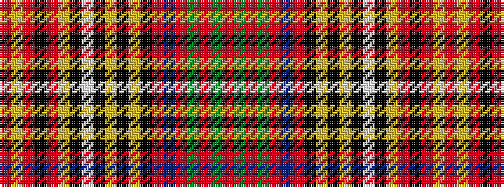

RGRGRBRKYKYKWKYRKRYR

It is a 20 stripe tartan.

<figure class="pat-woven">

<figcaption>idealised sample</figcaption>
</figure>

## Colour Sequence



## Tartans with this colour sequence

| Tartans |
|---------------|
| [Anderson](/setts/s20/r4g6r2g6r3db4r2k4ly2k2ly2k3w3k3lg18r2k2r2lg6r3~x2/)|
||
