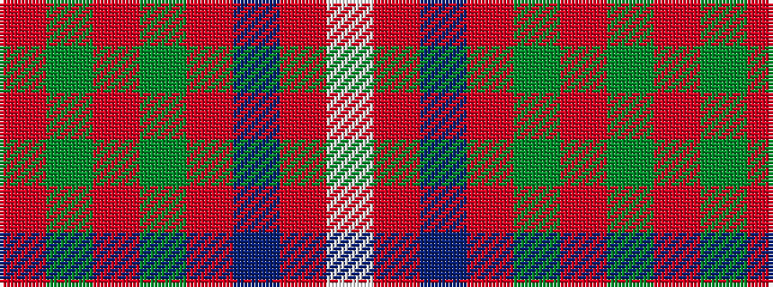

RGRGRBRW

It is a 8 stripe tartan.

<figure class="pat-woven">

<figcaption>idealised sample</figcaption>
</figure>

## Colour Sequence



## Tartans with this colour sequence

| Tartans |
|---------------|
| [Hall, from Springbrook and Newtown (Personal)](/setts/s8/w3m11db4m6dg48o2dg3o2~x2/)|
||
