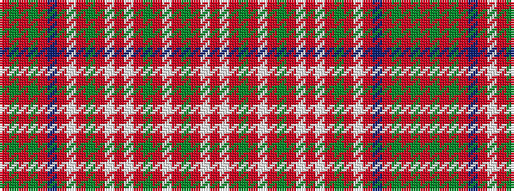

RGRGRBRWRGRWRWRGRWRGRWR

It is a 23 stripe tartan.

<figure class="pat-woven">

<figcaption>idealised sample</figcaption>
</figure>

## Colour Sequence



## Tartans with this colour sequence

| Tartans |
|---------------|
| [MacAlister CC](/setts/s23/r32dg8r4dg8r8db8r12lb1r1dg18r1lb1r32lb1r1dg18r1lb1r12dg6r1lb1r4~x2/)|
||
