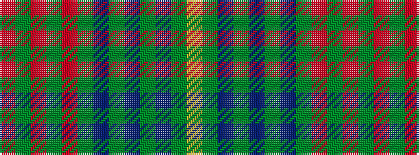

RGRGRGBGBGBGY

It is a 13 stripe tartan.

<figure class="pat-woven">

<figcaption>idealised sample</figcaption>
</figure>

## Colour Sequence



## Tartans with this colour sequence

| Tartans |
|---------------|
| [Johansson (Aneby, Sweden), Christian (Personal)](/variants/s13/o8y1o1y1o1y25dt1y1dt1y1dt25yi7lo6~x2/)|
||
