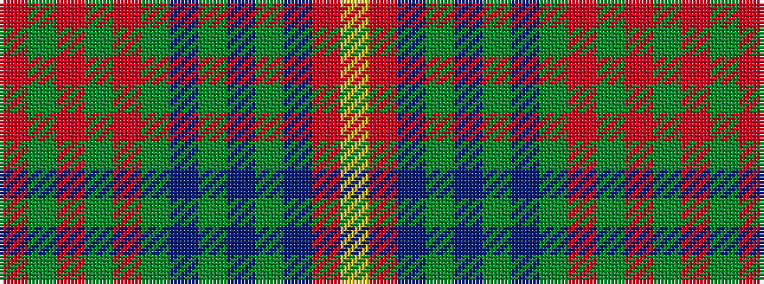

RGRGRGBGBGBRY

It is a 13 stripe tartan.

<figure class="pat-woven">

<figcaption>idealised sample</figcaption>
</figure>

## Colour Sequence



## Tartans with this colour sequence

| Tartans |
|---------------|
| [Johansson (Personal)](/setts/s13/r8y1r1y1r1y25n1y1n1y1n25o7lo6~x2/)|
||
