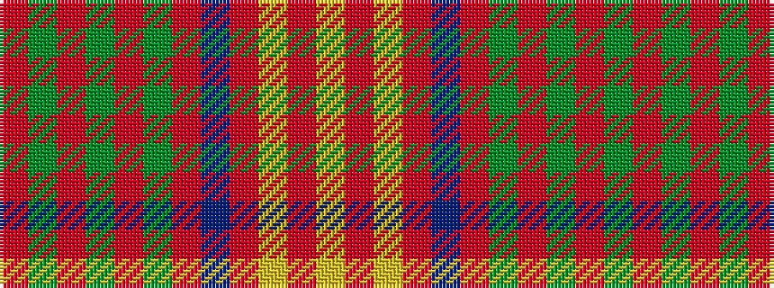

RGRGRGRBRYRY

It is a 12 stripe tartan.

<figure class="pat-woven">

<figcaption>idealised sample</figcaption>
</figure>

## Colour Sequence



## Tartans with this colour sequence

| Tartans |
|---------------|
| [Burns](/variants/s12/r3g3r3g14r3g3r3db5r18ly2r8ly2~x2/)|
||
| [Burns 1930](/variants/s12/r2g2r2g8r2g2r2db2r11ly1r4ly1~x4/)|
||
