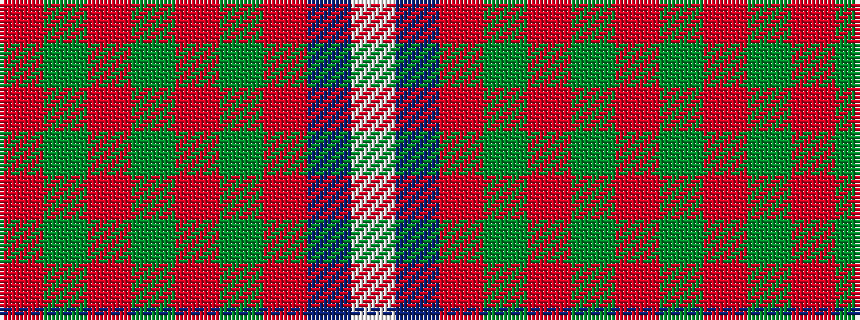

RGRGRGRBW

It is a 9 stripe tartan.

<figure class="pat-woven">

<figcaption>idealised sample</figcaption>
</figure>

## Colour Sequence



## Tartans with this colour sequence

| Tartans |
|---------------|
| [Baluch Regiment (Military)](/setts/s9/r5g20r5g3r4g5r36do2w4~x2/)|
||
