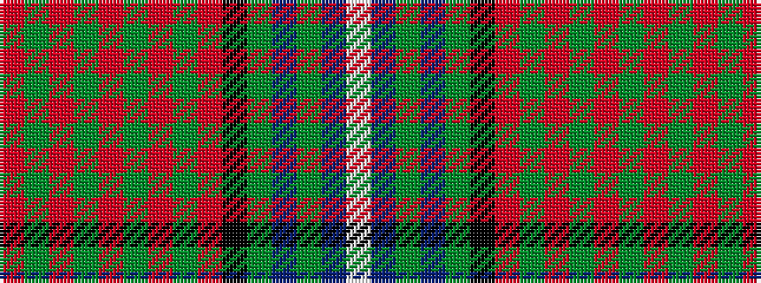

RGRGRGRGRKGBGBW

It is a 15 stripe tartan.

<figure class="pat-woven">

<figcaption>idealised sample</figcaption>
</figure>

## Colour Sequence



## Tartans with this colour sequence

| Tartans |
|---------------|
| [Moir (Loch Insch) (Personal)](/setts/s15/r31g3r2g2r3g2r2g3r15k15g2t15g3t3w2~x2/)|
||
