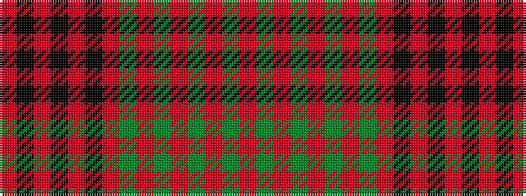

RGRGRGRGRKRKRKR

It is a 15 stripe tartan.

<figure class="pat-woven">

<figcaption>idealised sample</figcaption>
</figure>

## Colour Sequence



## Tartans with this colour sequence

| Tartans |
|---------------|
| [MacDonell of Keppoch](/setts/s15/r24g4r2g2r2g2r12g24r1k1r24k1r1k1r6~x2/)|
||
| [MacDonell of Keppoch #3](/setts/s15/r12g2r1g1r1g1r6g12r1k1r12k1r1k1r3~x4/)|
||
