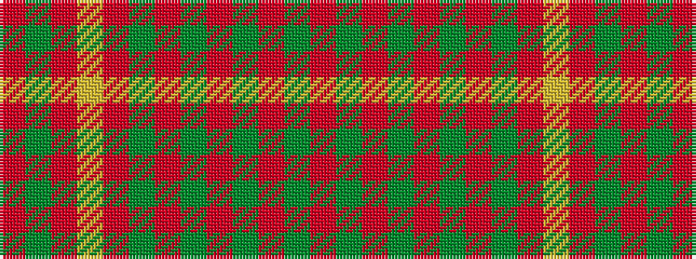

RGRGRGRGRYRGR

It is a 13 stripe tartan.

<figure class="pat-woven">

<figcaption>idealised sample</figcaption>
</figure>

## Colour Sequence



## Tartans with this colour sequence

| Tartans |
|---------------|
| [MacRurie, MacRory](/setts/s13/r10g12r3g12r12g4r5g5r12ly4r5g12r4~x2/)|
||
| [MacRurie/MacRory](/setts/s13/r8g10r2g10r9g3r4g4r10ly3r3g10r3~x2/)|
||
