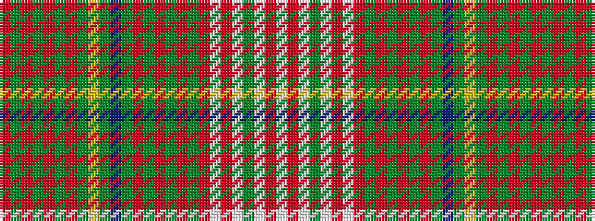

RGRGRGRGYGBGRGRGRGRWRWGWRW

It is a 26 stripe tartan.

<figure class="pat-woven">

<figcaption>idealised sample</figcaption>
</figure>

## Colour Sequence



## Tartans with this colour sequence

| Tartans |
|---------------|
| [Maple Leaf Dress (Lumsden)](/setts/s26/m1dg1m6g5m6dg1m1dg9lo3g3do3dg9m1dg1m6g5m6dg1m1w1m1w12g1w12m1w1~x4/)|
||
