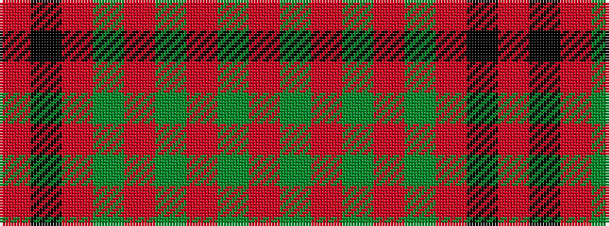

RGRGRGRKR

It is a 9 stripe tartan.

<figure class="pat-woven">

<figcaption>idealised sample</figcaption>
</figure>

## Colour Sequence



## Tartans with this colour sequence

| Tartans |
|---------------|
| [Maxwell Variant](/variants/s9/r40k15r6dg32r6dg32r40dg2r20/)|
||
