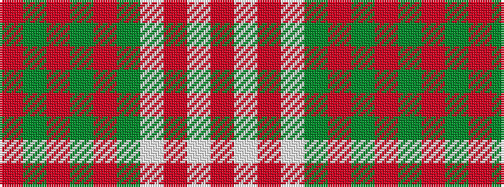

RGRGRGWRWR

It is a 10 stripe tartan.

<figure class="pat-woven">

<figcaption>idealised sample</figcaption>
</figure>

## Colour Sequence



## Tartans with this colour sequence

| Tartans |
|---------------|
| [Old Spice (Corporate)](/setts/s10/r104dg3r5dg3r18dg8w9r9w9r3/)|
||
