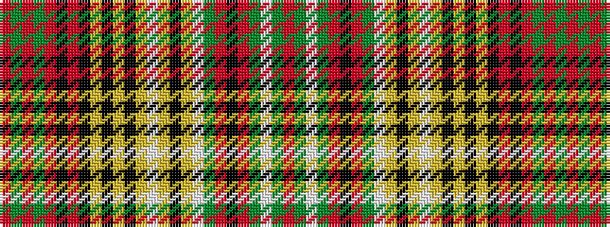

RGRGRKRKYKYKYWYKYWGRKRGWGR

It is a 26 stripe tartan.

<figure class="pat-woven">

<figcaption>idealised sample</figcaption>
</figure>

## Colour Sequence



## Tartans with this colour sequence

| Tartans |
|---------------|
| [Anderson](/setts/s26/r16g2w24g2r6k6r6g2w66ly2k12ly2w12ly2k4ly4k4ly4k7r2k7r6g20r6g20r12/)|
||
