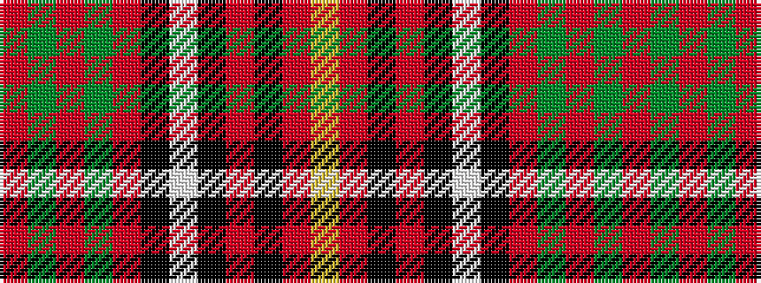

RGRGRKWKRKRY

It is a 12 stripe tartan.

<figure class="pat-woven">

<figcaption>idealised sample</figcaption>
</figure>

## Colour Sequence



## Tartans with this colour sequence

| Tartans |
|---------------|
| [Ikelman No. 6](/variants/s12/r16g2r3g2r13ki12w2ki12r13k13r2ly2~x2/)|
||
