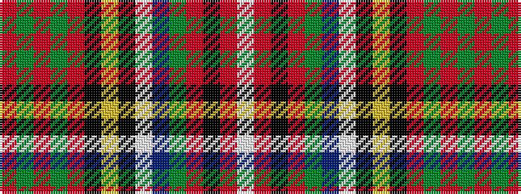

RGRGRKYKWBGRKRW

It is a 15 stripe tartan.

<figure class="pat-woven">

<figcaption>idealised sample</figcaption>
</figure>

## Colour Sequence



## Tartans with this colour sequence

| Tartans |
|---------------|
| [Stewart of Appin 5](/setts/s15/r3g1r2g1r18k4ly1k2w1db4g6r3k1r2w1~x2/)|
||
| [Stuart/Stewart of Appin #4](/setts/s15/r3dg1r2dg1r18k4ly1k2w1db4dg6r3k1r2w1~x2/)|
||
