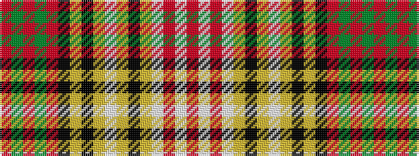

RGRGRKYKYWYKYWRWR

It is a 17 stripe tartan.

<figure class="pat-woven">

<figcaption>idealised sample</figcaption>
</figure>

## Colour Sequence



## Tartans with this colour sequence

| Tartans |
|---------------|
| [Anderson Dress](/variants/s17/r3w5r2w12ly1k2ly1w2ly1k2ly2k2r1dg4r2dg4r2~x2/)|
||
| [Anderson, dress](/variants/s17/r3w5r2w12ly1k2ly1w2ly1k2ly2k2r1g4r2g4r2~x2/)|
||
