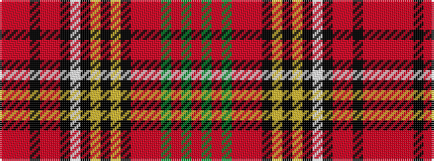

RGRGRRRKYKYKWKRRKRRR

It is a 20 stripe tartan.

<figure class="pat-woven">

<figcaption>idealised sample</figcaption>
</figure>

## Colour Sequence



## Tartans with this colour sequence

| Tartans |
|---------------|
| [Anderson, Red (Fashion)](/setts/s20/r4y5r2y7r3r4r3k4lo2k2lo2k4w4k4r18r1k2r1r4r3~x2/)|
||
