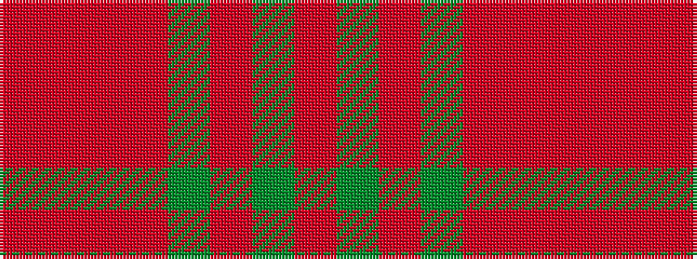

RGRGRRRR

It is a 8 stripe tartan.

<figure class="pat-woven">

<figcaption>idealised sample</figcaption>
</figure>

## Colour Sequence



## Tartans with this colour sequence

| Tartans |
|---------------|
| [Beck-McSorley](/setts/s8/r1o1m1o7dg7m1dg1m1~x6/)|
||
