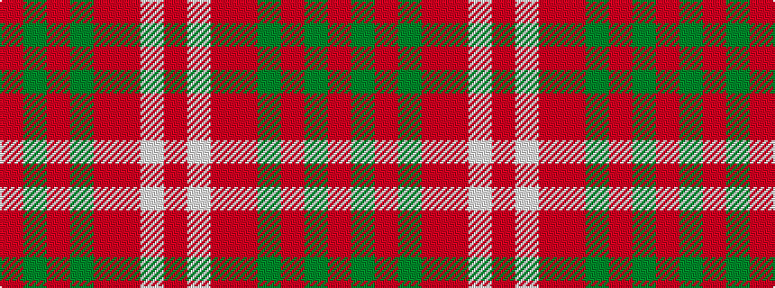

RGRGRRWR

It is a 8 stripe tartan.

<figure class="pat-woven">

<figcaption>idealised sample</figcaption>
</figure>

## Colour Sequence



## Tartans with this colour sequence

| Tartans |
|---------------|
| [Gudbrandsdalen, Rondastakken](/setts/s8/r65w2r3ri4g11r3g3r11~x2/)|
||
| [Gudbrandsdalen, Rondastakken](/setts/s8/r65w2r3ri4dg11r3dg3r11/)|
||
