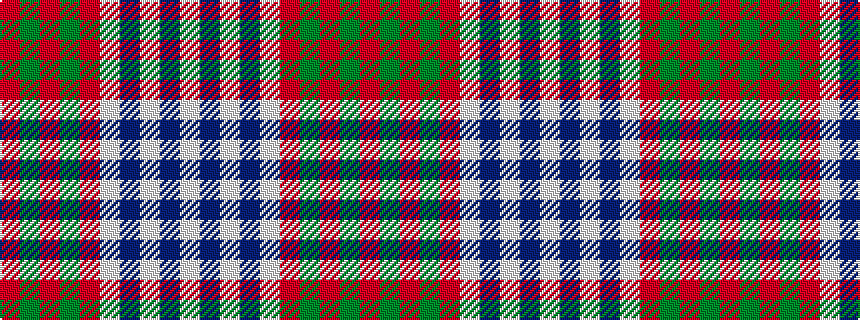

RGRGRWBWBW

It is a 10 stripe tartan.

<figure class="pat-woven">

<figcaption>idealised sample</figcaption>
</figure>

## Colour Sequence



## Tartans with this colour sequence

| Tartans |
|---------------|
| [Prince of Denmark](/variants/s10/r51dy2r2dy2r3w3db2w2db2w8~x2/)|
||
