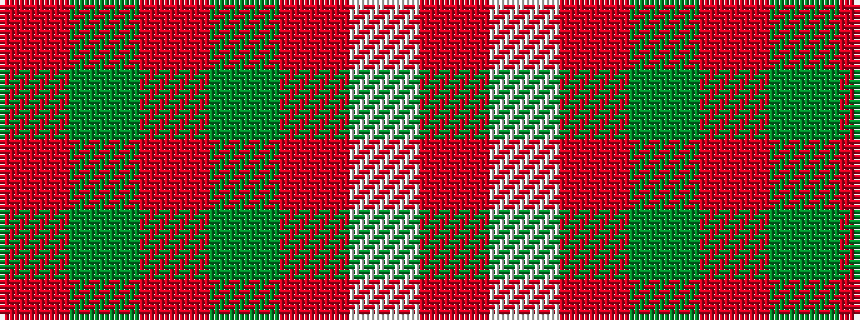

RGRGRWR

It is a 7 stripe tartan.

<figure class="pat-woven">

<figcaption>idealised sample</figcaption>
</figure>

## Colour Sequence



## Tartans with this colour sequence

| Tartans |
|---------------|
| [Crawford](/variants/s7/r6lb2r30dg12r3dg12r3/)|
||
| [Crawford](/variants/s7/r6w2r30g12r3g12r3~x2/)|
||
| [Crawford](/variants/s7/m6lb2m30g12m3g12m3~x2/)|
||
| [Crawford (Clan)](/variants/s7/m6w2m30g12m3g12m3~x2/)|
||
| [Wasko (Personal)](/variants/s7/r8w2m30g12m3g12m3~x2/)|
||
