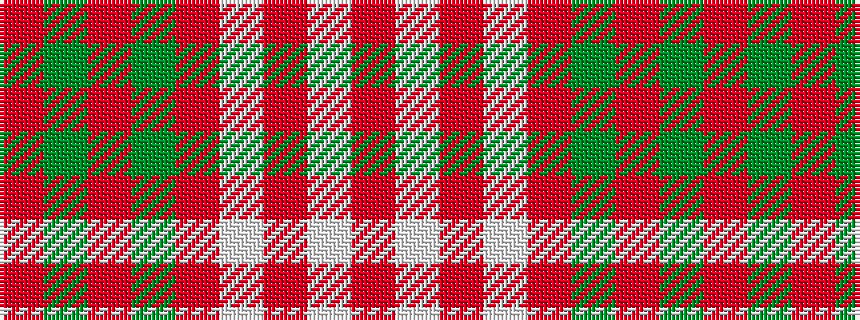

RGRGRWRWR

It is a 9 stripe tartan.

<figure class="pat-woven">

<figcaption>idealised sample</figcaption>
</figure>

## Colour Sequence



## Tartans with this colour sequence

| Tartans |
|---------------|
| [Crawford Arisaid (Dance)](/variants/s9/r6w1r2w25r3g12r3g12r3~x2/)|
||
