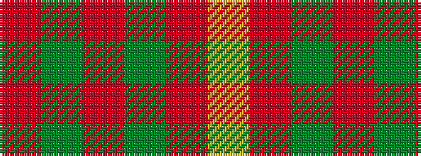

RGRGRY

It is a 6 stripe tartan.

<figure class="pat-woven">

<figcaption>idealised sample</figcaption>
</figure>

## Colour Sequence



## Tartans with this colour sequence

| Tartans |
|---------------|
| [Cameron](/setts/s6/r1g3r1g3r8ly1~x8/)|
||
| [Cameron](/setts/s6/r2dg6r2dg6r16ly1~x2/)|
||
| [Cameron](/setts/s6/r2g6r2g6r16ly1~x2/)|
||
| [Cameron (Clan)](/setts/s6/r2g6r2g6r16ly1~x4/)|
||
| [Cameron Clan D](/setts/s6/r1dg6r1dg6r15ly1~x2/)|
||
| [Maguire, Black](/setts/s6/r29g2r2g2r6ly21~x4/)|
||
| [Maguire, Black (Name)](/setts/s6/r29g2r2g2r6lo21~x4/)|
||
