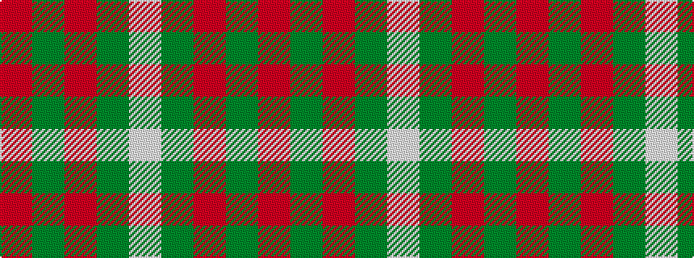

RGRGW

It is a 5 stripe tartan.

<figure class="pat-woven">

<figcaption>idealised sample</figcaption>
</figure>

## Colour Sequence



## Tartans with this colour sequence

| Tartans |
|---------------|
| [MacGregor](/variants/s5/r39g6r2g3w1~x2/)|
||
| [MacGregor #2](/variants/s5/r39dg6r2dg3w1~x2/)|
||
| [Welsh National (District)](/variants/s5/r8g3r4g44w4~x2/)|
||
| [Welsh National District Tartan](/variants/s5/m2g1m1g10w1~x4/)|
||
| [Welsh, National](/variants/s5/r2g1r1g11w1~x8/)|
||
