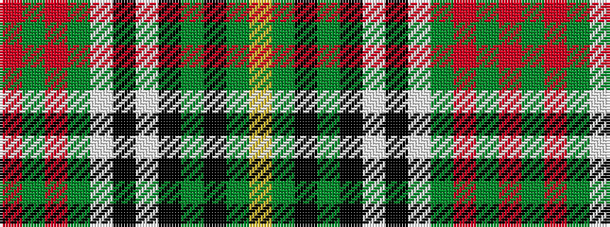

RGRGWKWKGKGY

It is a 12 stripe tartan.

<figure class="pat-woven">

<figcaption>idealised sample</figcaption>
</figure>

## Colour Sequence



## Tartans with this colour sequence

| Tartans |
|---------------|
| [Stuart/Stewart Authentic Grey](/setts/s12/r1y20r1y3w1k1w1k4y3k1y2ly1~x2/)|
||
