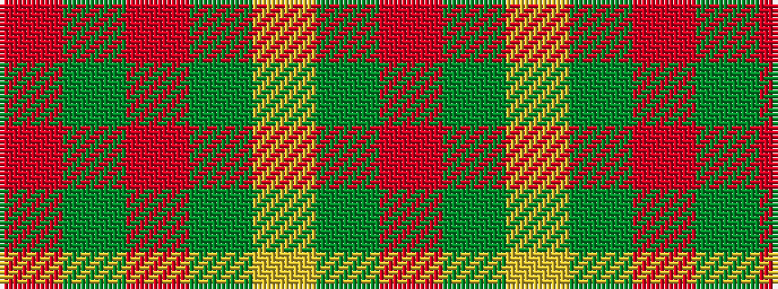

RGRGYGR

It is a 7 stripe tartan.

<figure class="pat-woven">

<figcaption>idealised sample</figcaption>
</figure>

## Colour Sequence



## Tartans with this colour sequence

| Tartans |
|---------------|
| [Kilkenny](/variants/s7/m5dg27o2g25ly7dg3m3~x2/)|
||
