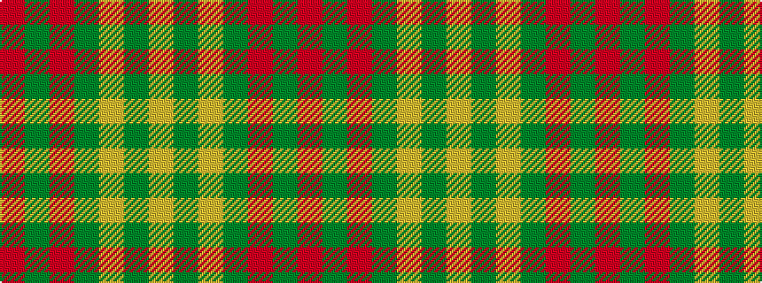

RGRGYGY

It is a 7 stripe tartan.

<figure class="pat-woven">

<figcaption>idealised sample</figcaption>
</figure>

## Colour Sequence



## Tartans with this colour sequence

| Tartans |
|---------------|
| [O'Neill Pipe Band 1983 (Corporate)](/variants/s7/o1g1o5g8lg1g1lg1~x4/)|
||
