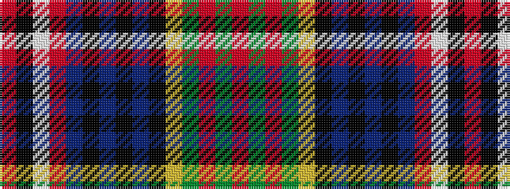

RGRGYKBKBKBRWKR

It is a 15 stripe tartan.

<figure class="pat-woven">

<figcaption>idealised sample</figcaption>
</figure>

## Colour Sequence



## Tartans with this colour sequence

| Tartans |
|---------------|
| [MacPherson #8](/variants/s15/r14dg3r14dg13ly2k14db6k2db2k2db6r9w2k2r2~x2/)|
||
| [MacPherson 7](/variants/s15/r14g3r14g13ly2k14db6k2db2k2db6r9w2k2r2~x2/)|
||
